# Relatório de Testes de Carga - Computação Distribuída

Este documento apresenta os resultados dos testes de carga realizados em uma aplicação WordPress utilizando Locust para geração de tráfego e Nginx como balanceador de carga. O objetivo foi avaliar o comportamento da aplicação sob diferentes níveis de concorrência e escalabilidade horizontal.

---

# Estrutura do Ambiente

- **Balanceador de Carga:** Nginx
- **Aplicação:** WordPress (1, 2 e 3 instâncias)
- **Banco de Dados:** MySQL 8.0
- **Gerador de Carga:** Locust (Python)
- **Containerização:** Docker Compose

---

# Cenários de Teste

| Cenário | Endpoint | Tamanho Médio |
|---|---|---|
| Texto 1 | `/?p=13` | ~324 KB |
| Texto 2 | `/?p=21` | ~575 KB |
| Texto 3 | `/?p=28` | ~223 KB |
| Híbrido | Aggregated | Todas as rotas simultaneamente |

---

# Metodologia de Teste

1. O ambiente foi configurado utilizando Docker Compose.
2. O balanceamento entre múltiplas instâncias WordPress foi realizado através do Nginx.
3. Os testes foram executados utilizando o Locust com cargas de:
   - 400 usuários simultâneos
   - 500 usuários simultâneos
   - 600 usuários simultâneos
4. Foram avaliados ambientes contendo:
   - 1 instância WordPress
   - 2 instâncias WordPress
   - 3 instâncias WordPress
5. Cada execução permaneceu ativa por aproximadamente 2 minutos para estabilização das métricas.
6. Foram coletadas métricas de:
   - Requests por segundo (RPS)
   - Mediana de tempo de resposta
   - Percentil P95
   - Percentil P99
   - Média de resposta
   - Taxa de falhas

---

# Comparativo Geral entre Rotas e Cenário Híbrido

O comparativo geral tem como objetivo analisar o impacto do tamanho da resposta e da concorrência simultânea em diferentes endpoints da aplicação.

## Comparativo Geral - Mediana de Resposta

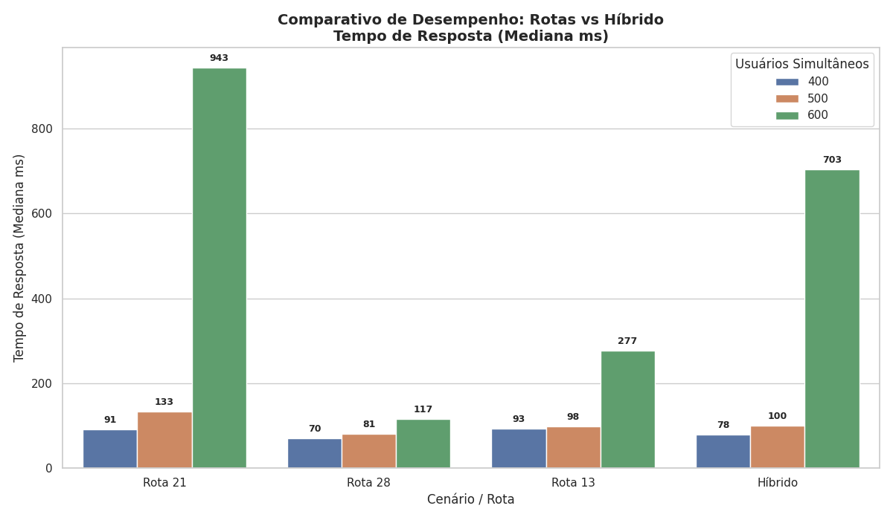

## Comparativo Geral - P95

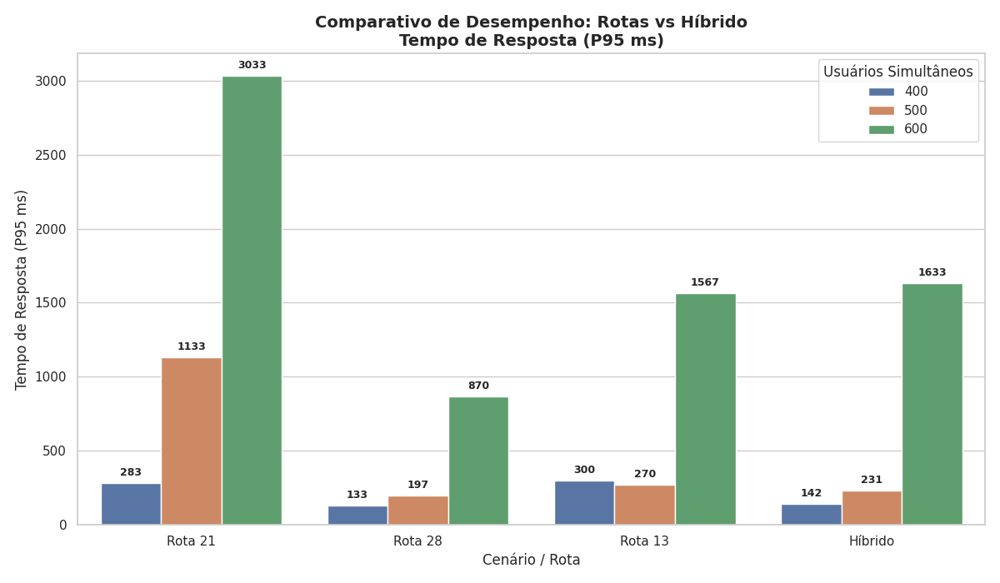

---

# Análise Geral dos Resultados

Os resultados mostram um comportamento diretamente relacionado ao tamanho do payload transferido:

- A rota `/?p=21`, contendo aproximadamente 575 KB, apresentou os maiores tempos de resposta e maior sensibilidade ao aumento de usuários.
- A rota `/?p=28`, com aproximadamente 223 KB, apresentou os menores tempos médios e maior estabilidade.
- O cenário híbrido apresentou comportamento intermediário, mas evidenciou sobrecarga significativa quando múltiplas rotas foram acessadas simultaneamente.
- O aumento de instâncias não trouxe escalabilidade linear, devido à limitação dos recursos físicos compartilhados da máquina hospedeira.

---

# 1. Cenário: Texto 1 (`/?p=13`)

## Objetivo

Avaliar o desempenho da aplicação entregando um payload médio de aproximadamente 324 KB.

---

## Resultados

| Instâncias | Usuários | Requests | Falhas | Mediana (ms) | P95 (ms) | P99 (ms) | Média (ms) | RPS |
|---|---|---|---|---|---|---|---|---|
| 1 | 400 | 7825 | 0 | 80 | 130 | 390 | 89.38 | 65.1 |
| 1 | 500 | 9745 | 0 | 88 | 180 | 390 | 99.63 | 82.4 |
| 1 | 600 | 11103 | 0 | 200 | 1200 | 1500 | 355.73 | 96.0 |
| 2 | 400 | 7770 | 0 | 120 | 460 | 740 | 153.89 | 66.2 |
| 2 | 500 | 9676 | 0 | 110 | 370 | 540 | 138.75 | 79.4 |
| 2 | 600 | 10917 | 43 | 160 | 1800 | 2700 | 446.10 | 92.9 |
| 3 | 400 | 7839 | 0 | 80 | 310 | 650 | 109.04 | 67.1 |
| 3 | 500 | 9705 | 0 | 95 | 260 | 440 | 112.38 | 78.8 |
| 3 | 600 | 10642 | 9 | 470 | 1700 | 2400 | 614.47 | 90.5 |

---

## Gráficos

### RPS vs Instâncias

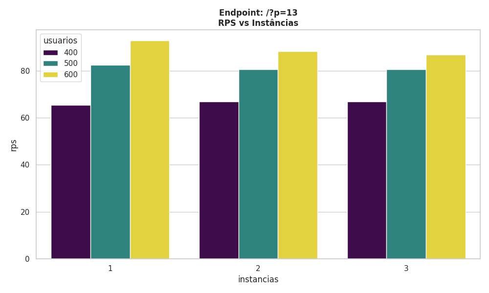

### Mediana vs Usuários

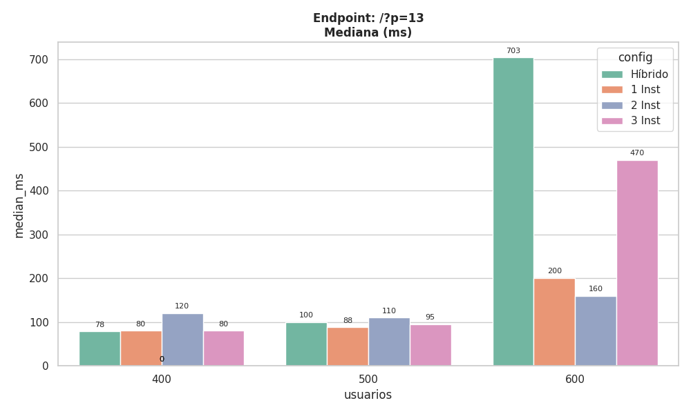

### P95 vs Usuários

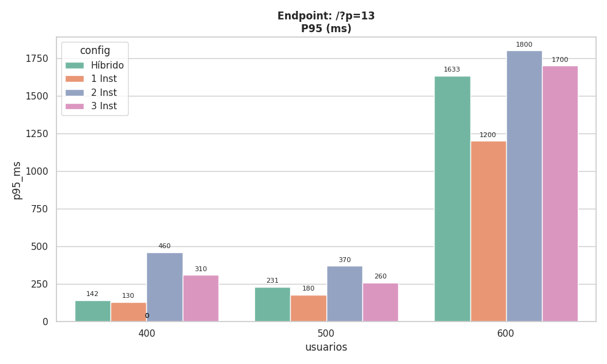

### Taxa de Falhas

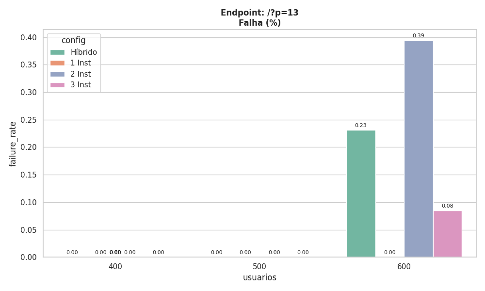

---

## Análise

- Até 500 usuários simultâneos o sistema manteve estabilidade.
- Em 600 usuários começaram a surgir falhas em ambientes com múltiplas instâncias.
- O ganho de RPS foi limitado devido à contenção de CPU e I/O.
- O P95 aumentou significativamente em cenários de maior concorrência.

---

# 2. Cenário: Texto 2 (`/?p=21`)

## Objetivo

Avaliar o impacto do maior volume de transferência de dados (~575 KB).

---

## Resultados

| Instâncias | Usuários | Requests | Falhas | Mediana (ms) | P95 (ms) | P99 (ms) | Média (ms) | RPS |
|---|---|---|---|---|---|---|---|---|
| 1 | 400 | 7837 | 0 | 93 | 430 | 690 | 128.75 | 64.5 |
| 1 | 500 | 9449 | 0 | 130 | 1300 | 2400 | 270.00 | 79.8 |
| 1 | 600 | 9809 | 0 | 1000 | 2800 | 3800 | 1133.11 | 76.5 |
| 2 | 400 | 7817 | 0 | 90 | 180 | 370 | 100.47 | 65.8 |
| 2 | 500 | 9467 | 0 | 140 | 900 | 1400 | 260.27 | 73.7 |
| 2 | 600 | 9698 | 100 | 940 | 3000 | 3600 | 1223.52 | 78.4 |
| 3 | 400 | 7826 | 0 | 91 | 240 | 420 | 105.17 | 65.8 |
| 3 | 500 | 9452 | 0 | 130 | 1200 | 1700 | 275.69 | 70.2 |
| 3 | 600 | 9802 | 199 | 890 | 3300 | 4000 | 1146.11 | 78.5 |

---

## Gráficos

### RPS vs Instâncias

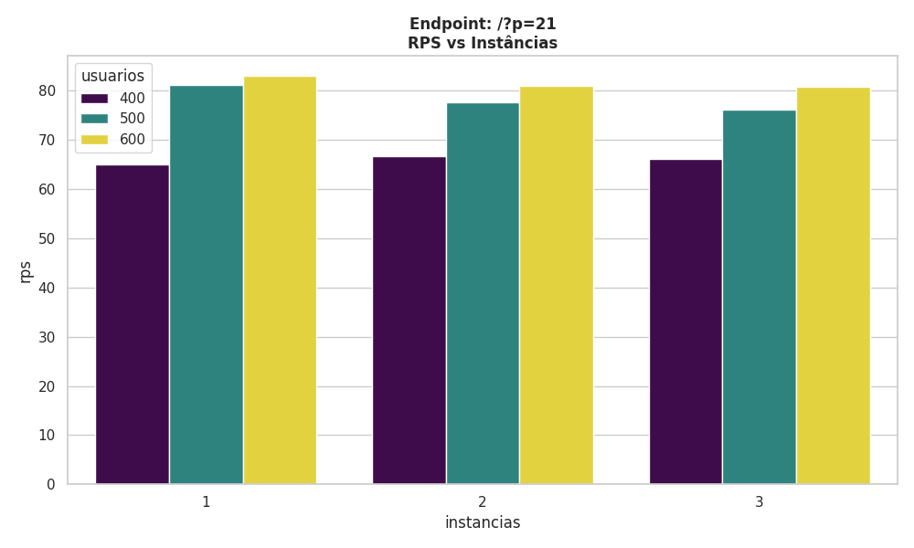

### Mediana vs Usuários

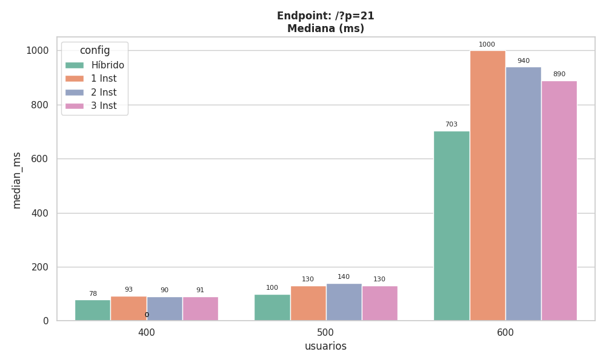

### P95 vs Usuários

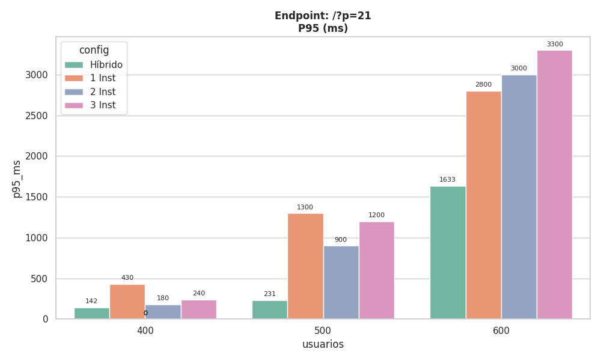

### Taxa de Falhas

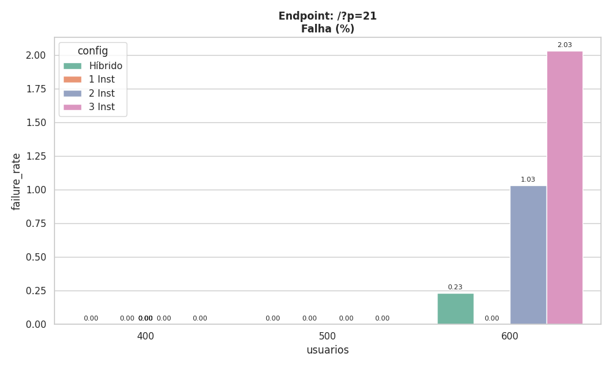

---

## Análise

- Este cenário apresentou os maiores tempos de resposta.
- A combinação de payload elevado com alta concorrência provocou saturação rápida.
- Em 600 usuários surgiram falhas relevantes:
  - 100 falhas em 2 instâncias
  - 199 falhas em 3 instâncias
- O aumento de instâncias não conseguiu compensar o gargalo físico da máquina.

---

# 3. Cenário: Texto 3 (`/?p=28`)

## Objetivo

Avaliar o desempenho da aplicação com payload menor (~223 KB).

---

## Resultados

| Instâncias | Usuários | Requests | Falhas | Mediana (ms) | P95 (ms) | P99 (ms) | Média (ms) | RPS |
|---|---|---|---|---|---|---|---|---|
| 1 | 400 | 7844 | 0 | 69 | 120 | 300 | 76.63 | 66.0 |
| 1 | 500 | 9704 | 0 | 78 | 220 | 340 | 90.99 | 83.0 |
| 1 | 600 | 11388 | 0 | 110 | 720 | 910 | 200.08 | 98.1 |
| 2 | 400 | 7875 | 0 | 70 | 130 | 290 | 79.10 | 65.2 |
| 2 | 500 | 9746 | 0 | 81 | 170 | 290 | 89.75 | 81.6 |
| 2 | 600 | 11296 | 0 | 120 | 950 | 1500 | 246.93 | 94.4 |
| 3 | 400 | 7854 | 0 | 70 | 150 | 310 | 80.59 | 68.1 |
| 3 | 500 | 9741 | 0 | 83 | 200 | 320 | 93.66 | 84.0 |
| 3 | 600 | 11277 | 0 | 120 | 940 | 1300 | 243.05 | 97.8 |

---

## Gráficos

### RPS vs Instâncias

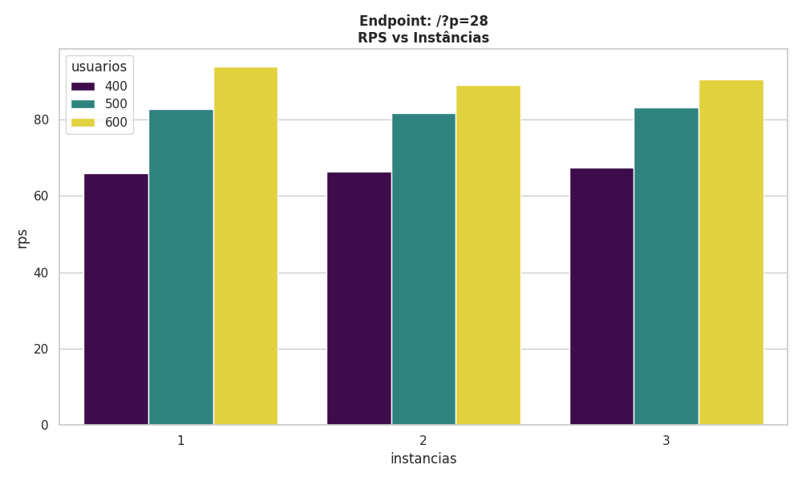

### Mediana vs Usuários

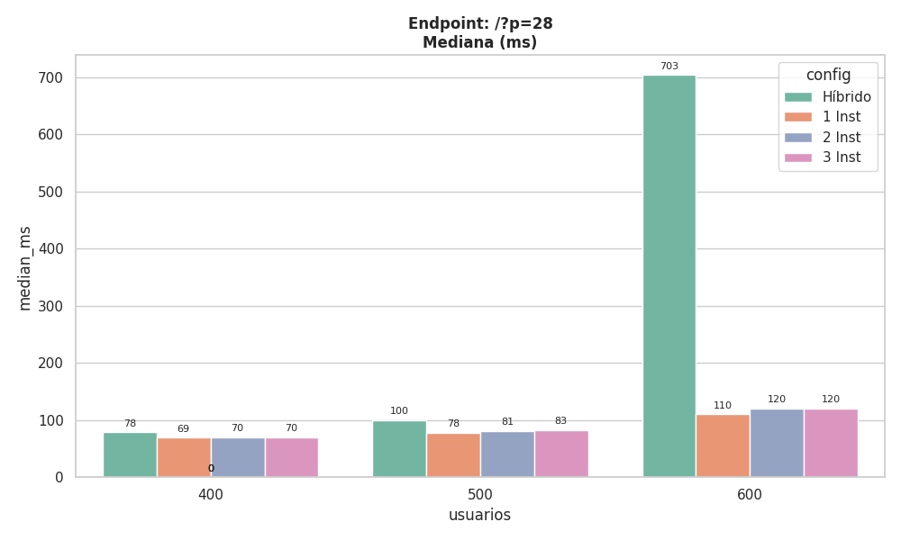

### P95 vs Usuários

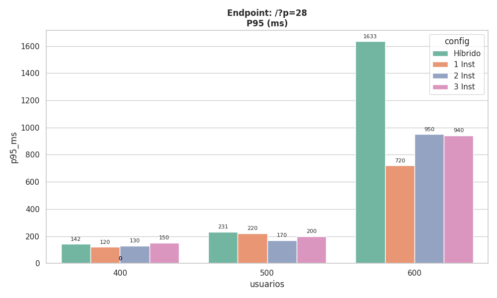

### Taxa de Falhas

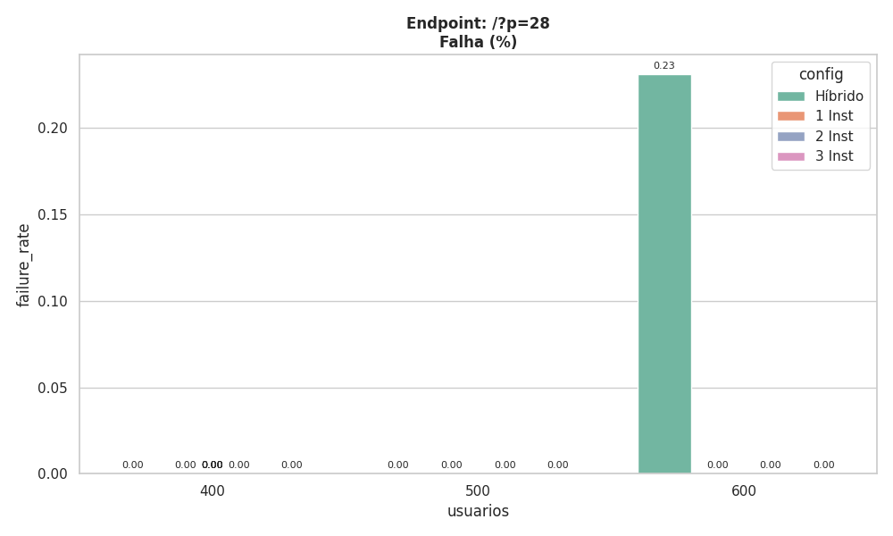

---

## Análise

- Este cenário apresentou os melhores resultados gerais.
- Mesmo com 600 usuários simultâneos não ocorreram falhas.
- O payload reduzido diminuiu significativamente o impacto em latência e throughput.
- O comportamento do sistema foi significativamente mais estável.

---

# 4. Cenário Híbrido

## Objetivo

Simular acessos simultâneos em múltiplas rotas para aproximar um cenário real de utilização.

---

## Resultados

| Instâncias | Usuários | Requests | Falhas | Mediana (ms) | P95 (ms) | P99 (ms) | Média (ms) | RPS |
|---|---|---|---|---|---|---|---|---|
| 1 | 400 | 7858 | 0 | 76.6 | 126.6 | 323.3 | 85.00 | 65.7 |
| 1 | 500 | 9665 | 0 | 99 | 213.3 | 340 | 110.35 | 82.4 |
| 1 | 600 | 10804 | 0 | 443.3 | 1366.6 | 1900 | 534.32 | 89.4 |
| 2 | 400 | 7858 | 0 | 79.3 | 140 | 310 | 87.83 | 67.6 |
| 2 | 500 | 9688 | 0 | 100 | 223.3 | 340 | 112.02 | 81.6 |
| 2 | 600 | 10330 | 20 | 796.6 | 1633.3 | 2366.6 | 789.77 | 83.6 |
| 3 | 400 | 7883 | 0 | 79.3 | 160 | 323.3 | 89.52 | 66.6 |
| 3 | 500 | 9670 | 0 | 100.6 | 256.6 | 356.6 | 115.75 | 82.3 |
| 3 | 600 | 10213 | 51 | 870 | 1900 | 2366 | 889.24 | 83.1 |

---

## Gráficos

### RPS vs Instâncias

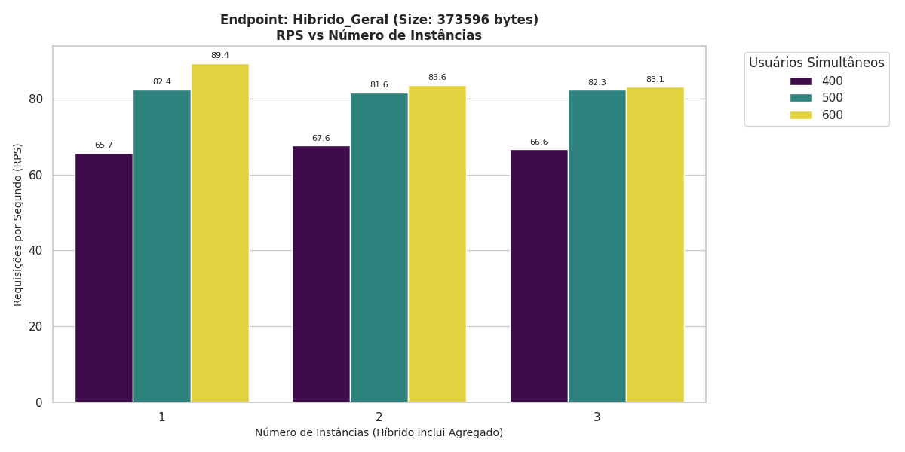

### Mediana vs Usuários

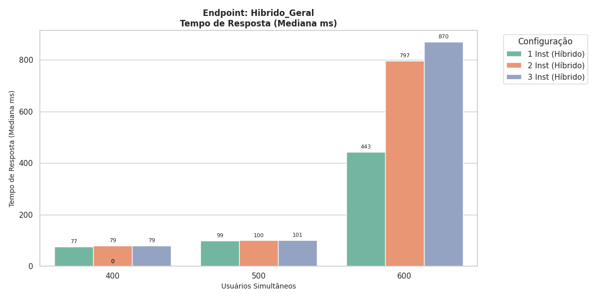

### P95 vs Usuários

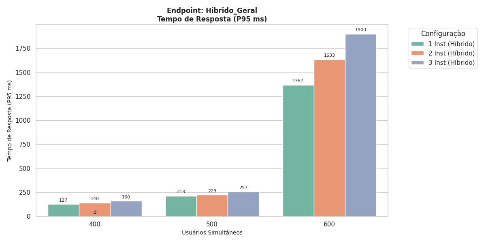

### Taxa de Falhas

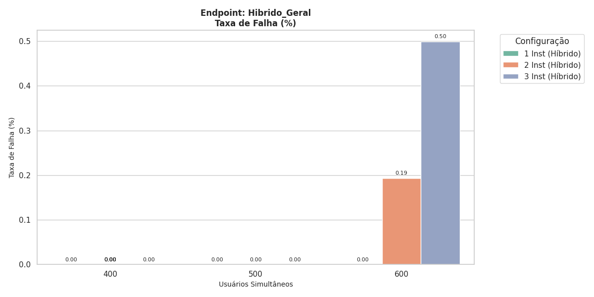

---

## Análise

- O cenário híbrido apresentou comportamento semelhante ao endpoint mais pesado (`/?p=21`).
- O aumento simultâneo de diferentes tipos de requisição elevou significativamente a latência.
- Em 600 usuários começaram a surgir falhas mesmo com múltiplas instâncias.
- A mistura de payloads provocou maior pressão sobre:
  - CPU
  - gerenciamento de memória
  - I/O de disco
  - cache interno do WordPress

---

# Conclusões

Após a análise dos resultados, destacam-se os seguintes pontos:

## 1. Escalabilidade Horizontal Limitada

O aumento de instâncias WordPress não gerou crescimento linear de desempenho, pois todas as instâncias estavam compartilhando o mesmo hardware físico.

Os principais gargalos observados foram:

- CPU
- Memória RAM
- I/O de disco
- Rede local

---

## 2. Impacto do Tamanho da Resposta

Endpoints maiores apresentaram degradação muito mais rápida sob carga elevada.

Ordem de impacto observada:

1. `/?p=21` → pior desempenho
2. Cenário Híbrido
3. `/?p=13`
4. `/?p=28` → melhor desempenho

---

## 3. Limite Operacional

O ambiente demonstrou estabilidade até aproximadamente 500 usuários simultâneos.

A partir de 600 usuários:

- aumento exponencial de latência
- crescimento do P95 e P99
- surgimento de falhas HTTP/timeout

---

## 4. Influência do Ambiente Local

Como os testes foram executados em notebook local, fatores externos impactaram diretamente os resultados:

- redução de clock por bateria
- múltiplas abas abertas
- variação de consumo do sistema operacional
- oscilações de rede

---

# Considerações Finais

Os testes demonstraram que:

- O WordPress consegue atender cargas moderadas de forma estável.
- O tamanho do payload possui impacto direto na latência.
- Escalabilidade horizontal exige também escalabilidade física.
- O balanceamento de carga ajuda na distribuição, mas não elimina gargalos de infraestrutura.