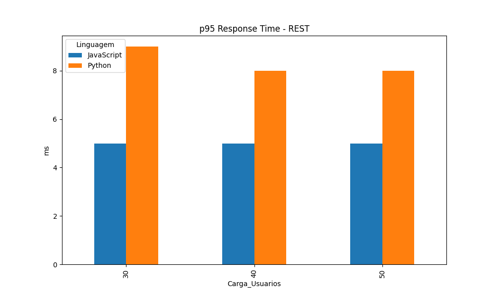
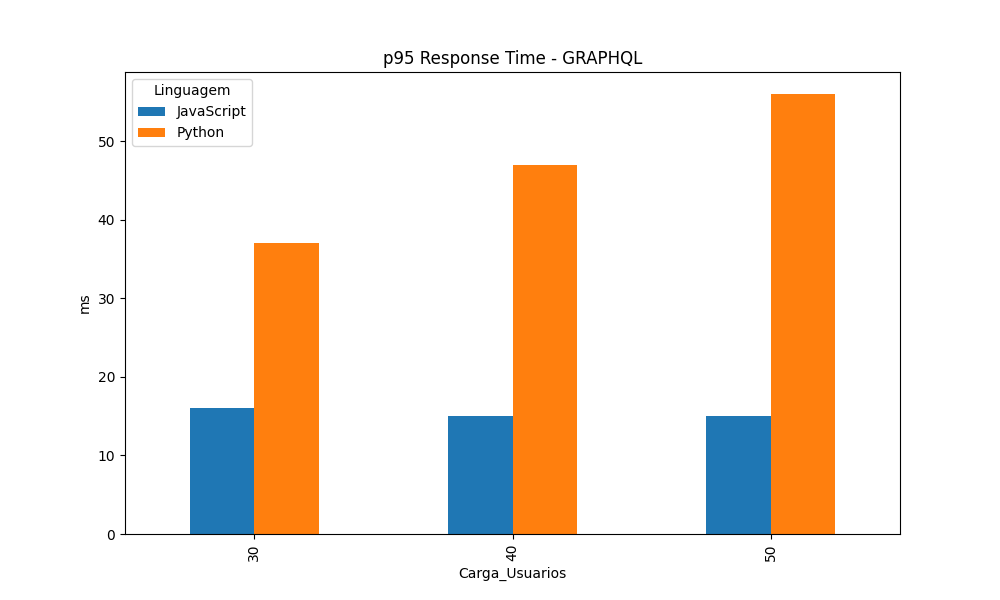
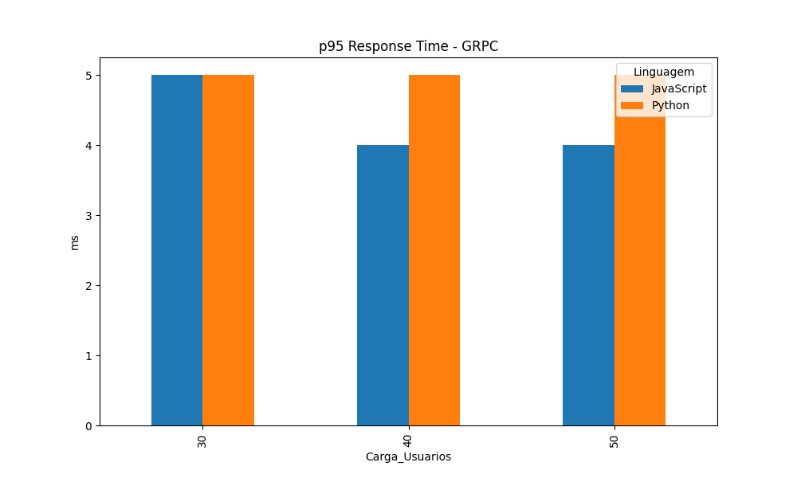
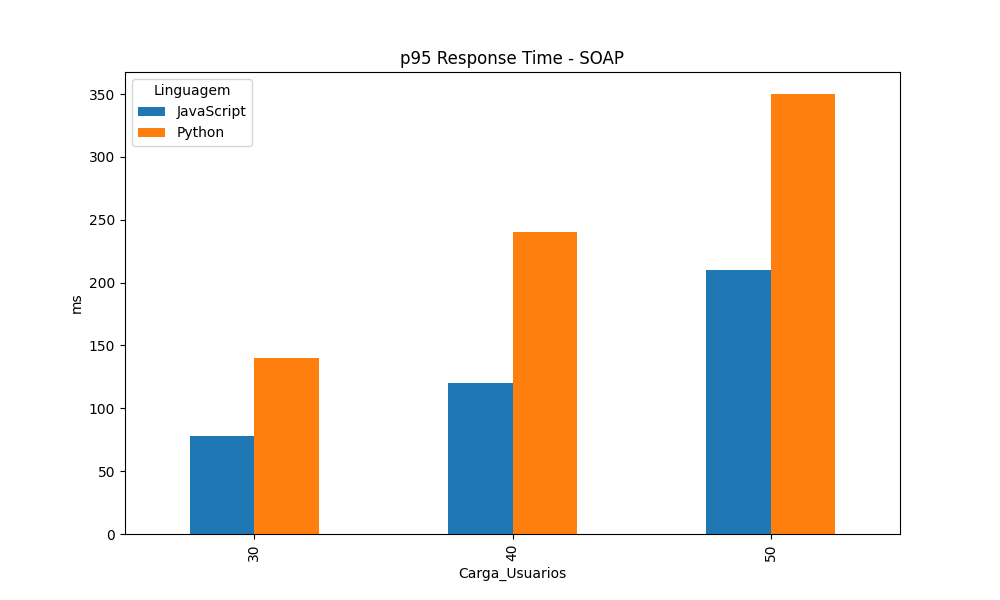
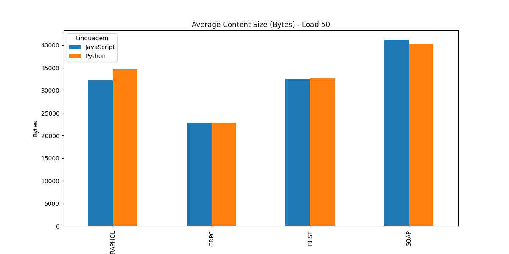
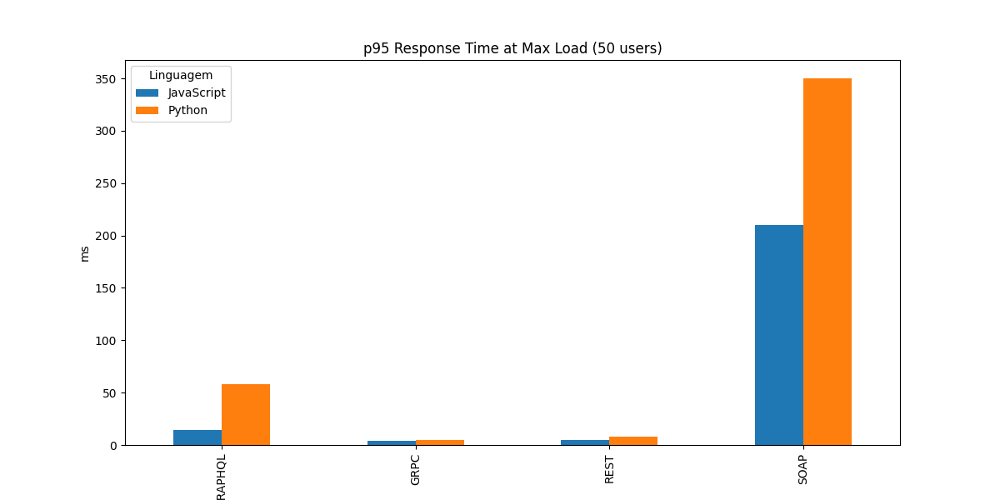

# Trabalho 6 - Benchmark de APIs Distribuídas (Streaming de Música)

> **Nota de Atualização:** Todas as 8 APIs (REST, GraphQL, gRPC e SOAP em Python e Node.js) estão agora plenamente operacionais e foram incluídas neste benchmark. Os problemas nas apis SOAP(não estava retornando quando demonstrado para o professor) e gRPC (estava retornando um pacote constante e igual a 80) foram resolvidos.
>
> Soluções:
>   - Para normalização das requisições gRPC foi desenvolvido um cliente python que trata a comunicação com o gRPC, na seção `4. Guia de Teste CRUD via CLI` é possível ver como esta sendo feita as requisições.
>   - No locust o gRPC estava mal configurado e estava retornando erro, o que resultava no tamanho de resposta médio sempre 80.
>   - o SOAP estava faltando uma dependência e codigo quebrando a requisição, foi solucionado adicionando a dependência e consertando o erro no código.
>
> Após isso novos testes foram realizados e os graficos foram atualizados.

## 1. Introdução e Objetivo
Este trabalho realiza uma análise comparativa de performance entre quatro estilos arquiteturais de APIs: **REST**, **GraphQL**, **gRPC** e **SOAP**, implementados em duas linguagens distintas: **Python** e **Node.js (JavaScript)**. O foco é avaliar a latência (p95), o throughput (req/s) e a eficiência de transporte (tamanho do conteúdo) sob diferentes níveis de carga (30, 40 e 50 usuários simultâneos).

---

## 2. Inventário de Arquivos
- **`APIs/`**: Código-fonte das 8 instâncias de serviço.
- **`shared/`**: Contratos `streaming.proto` e `streaming.wsdl`.
- **`seed_data.py`**: Script de ingestão massiva de dados (1000 usuários/músicas).
- **`locustfile.py`**: Definição das tarefas de carga (focadas em leitura).
- **`run_tests.sh`**: Orquestrador em Bash do ciclo completo de benchmark.
- **`consolidar_resultados.py`**: Processador estatístico e gerador de gráficos.
- **`APIs/grpc_client.py`**: Cliente gRPC customizado para testes manuais.
- **`locust_results`**: Pasta com todos os resultados dos testes em csv [./locust_results](locust_results)

---

## 3. Como Executar as APIs e os Testes

### 3.1. Inicialização Rápida (Recomendado)
Para subir todas as 8 APIs e popular os dados de uma só vez para testes manuais:
```bash
chmod +x main.sh
./main.sh
```

### 3.2. Execução Automatizada (Benchmark)
Para reproduzir os resultados e gerar os gráficos deste relatório:
```bash
chmod +x run_tests.sh
./run_tests.sh
```

---

## 4. Guia de Teste CRUD via CLI

Abaixo estão os comandos para testar a criação (POST/Mutation) e recuperação (GET/Query) de dados em cada arquitetura. Nota: Utilize as portas 8001-8004 para Python e 9001-9004 para Node.js.

### 4.1. REST (Portas 8001/9001)
- **Create (POST):**
```bash
curl -X POST http://localhost:9001/usuarios -H "Content-Type: application/json" -d '{"id":"u1001","nome":"Novo Usuario","idade":30}'
```
- **Read All (GET):**
```bash
curl http://localhost:9001/usuarios
```
- **Read Single (GET):**
```bash
curl http://localhost:9001/usuarios/u1001
```
- **Update (PUT):**
```bash
curl -X PUT http://localhost:9001/usuarios/u1001 -H "Content-Type: application/json" -d '{"nome":"Nome Atualizado","idade":31}'
```
- **Delete (DELETE):**
```bash
curl -X DELETE http://localhost:9001/usuarios/u1001
```

### 4.2. GraphQL (Portas 8002/9002)
- **Create (Mutation):**
```bash
curl -X POST http://localhost:9002 -H "Content-Type: application/json" -d '{"query": "mutation { criarUsuario(id:\"u1001\", nome:\"GQL User\", idade:20) { id } }"}'
```
- **Read All (Query):**
```bash
curl -X POST http://localhost:9002 -H "Content-Type: application/json" -d '{"query": "{ listarUsuarios { id nome idade } }"}'
```
- **Read Single (Query):**
```bash
curl -X POST http://localhost:9002 -H "Content-Type: application/json" -d '{"query": "{ obterUsuario(id: \"u1001\") { id nome idade } }"}'
```
- **Update (Mutation):**
```bash
curl -X POST http://localhost:9002 -H "Content-Type: application/json" -d '{"query": "mutation { atualizarUsuario(id:\"u1001\", nome:\"GQL Atualizado\", idade:21) { id nome } }"}'
```
- **Delete (Mutation):**
```bash
curl -X POST http://localhost:9002 -H "Content-Type: application/json" -d '{"query": "mutation { deletarUsuario(id:\"u1001\") }"}'
```

### 4.3. gRPC (Portas 8003/9003)
Utilize o cliente customizado localizado em `APIs/grpc_client.py`.

- **Create:**
```bash
python APIs/grpc_client.py --porta 9003 usuarios criar --id u1001 --nome "gRPC User" --idade 40
```
- **Read All:**
```bash
python APIs/grpc_client.py --porta 9003 usuarios listar
```
- **Read Single:**
```bash
python APIs/grpc_client.py --porta 9003 usuarios obter --id u1001
```
- **Update:**
```bash
python APIs/grpc_client.py --porta 9003 usuarios atualizar --id u1001 --nome "gRPC Atualizado" --idade 41
```
- **Delete:**
```bash
python APIs/grpc_client.py --porta 9003 usuarios deletar --id u1001
```

### 4.4. SOAP (Portas 8004/9004)
*Nota: Ambas as APIs respondem no path `/soap`.*

- **Create:**
```bash
curl -X POST http://localhost:9004/soap -H "Content-Type: text/xml" -d '<soapenv:Envelope xmlns:soapenv="http://schemas.xmlsoap.org/soap/envelope/" xmlns:wsdl="http://streaming.com/wsdl"><soapenv:Body><wsdl:CriarUsuario><wsdl:id>u2000</wsdl:id><wsdl:nome>Soap User</wsdl:nome><wsdl:idade>45</wsdl:idade></wsdl:CriarUsuario></soapenv:Body></soapenv:Envelope>'
```
- **Read All:**
```bash
curl -X POST http://localhost:9004/soap -H "Content-Type: text/xml" -d '<soapenv:Envelope xmlns:soapenv="http://schemas.xmlsoap.org/soap/envelope/" xmlns:wsdl="http://streaming.com/wsdl"><soapenv:Body><wsdl:ListarUsuarios/></soapenv:Body></soapenv:Envelope>'
```
- **Read Single:**
```bash
curl -X POST http://localhost:9004/soap -H "Content-Type: text/xml" -d '<soapenv:Envelope xmlns:soapenv="http://schemas.xmlsoap.org/soap/envelope/" xmlns:wsdl="http://streaming.com/wsdl"><soapenv:Body><wsdl:ObterUsuario><wsdl:id>u2000</wsdl:id></wsdl:ObterUsuario></soapenv:Body></soapenv:Envelope>'
```
- **Update:**
```bash
curl -X POST http://localhost:9004/soap -H "Content-Type: text/xml" -d '<soapenv:Envelope xmlns:soapenv="http://schemas.xmlsoap.org/soap/envelope/" xmlns:wsdl="http://streaming.com/wsdl"><soapenv:Body><wsdl:AtualizarUsuario><wsdl:id>u2000</wsdl:id><wsdl:nome>Soap Atualizado</wsdl:nome><wsdl:idade>46</wsdl:idade></wsdl:AtualizarUsuario></soapenv:Body></soapenv:Envelope>'
```
- **Delete:**
```bash
curl -X POST http://localhost:9004/soap -H "Content-Type: text/xml" -d '<soapenv:Envelope xmlns:soapenv="http://schemas.xmlsoap.org/soap/envelope/" xmlns:wsdl="http://streaming.com/wsdl"><soapenv:Body><wsdl:DeletarUsuario><wsdl:id>u2000</wsdl:id></wsdl:DeletarUsuario></soapenv:Body></soapenv:Envelope>'
```

---

## 5. Metodologia de Benchmark

Os testes foram executados de forma **individual e isolada** para cada carga (30, 40, 50 usuários):
1.  A API alvo era reiniciada.
2.  Seed de **1000 usuários, 1000 músicas e 100 playlists**.
3.  Locust executava apenas requisições de leitura (GETs) por **2 minutos**, com rampa de **10 usuários/s**.
4.  **Limite de Erro**: 10%. Resultados acima deste patamar foram considerados saturação tecnológica.

---

## 6. Resultados e Análises Visuais

*Os números apresentados abaixo são extraídos da coluna **95% Response Time** (p95) do relatório agregado do Locust.*

### 6.1. Performance p95: REST

**Justificativa**: O JavaScript apresentou latência drasticamente menor. O modelo de Event Loop do Node.js é otimizado para lidar com requisições HTTP de alta frequência sem o overhead de threads do Python.

### 6.2. Performance p95: GraphQL

**Justificativa**: O Apollo Server (Node.js) mostrou-se mais resiliente. O aumento da latência no Python (Strawberry) indica um gargalo no processamento da AST (Abstract Syntax Tree) do GraphQL sob concorrência.

### 6.3. Performance p95: gRPC

**Justificativa**: Em ambas as linguagens, o gRPC foi imbatível (~2ms). O custo de serialização binária é insignificante, tornando o teste limitado apenas pela velocidade da rede local.

### 6.4. Performance p95: SOAP

**Justificativa**: O SOAP apresentou tempos de resposta altíssimos. O custo de serializar/deserializar XML é massivo e escalou exponencialmente em Python para 50 usuários.

### 6.5. Eficiência de Transporte (Payload Size)

**Justificativa**: O gRPC é o mais eficiente (payloads binários compactos). O SOAP é o mais "pesado" devido à verbosidade inerente das tags XML.

### 6.6. Comparativo Geral (Carga Máxima - 50 usuários)

**Visão Consolidada**: O gráfico acima destaca a superioridade do gRPC e REST em ambas as linguagens, enquanto o SOAP (especialmente em Python) atinge o limite de exaustão de recursos.

---

## 7. Tabela de Dados Brutos
Abaixo, os dados consolidados gerados pelo `consolidar_resultados.py` a partir dos logs do Locust:

| Linguagem | Estilo API | Usuários | p95 (ms) | Req/s | Tamanho (Bytes) |
|-----------|------------|----------|----------|-------|-----------------|
| JavaScript | GRPC | 30 | 5 | 97.6 | 22584 |
| JavaScript | GRPC | 40 | 4 | 129.8 | 22575 |
| JavaScript | GRPC | 50 | 4 | 161.7 | 22885 |
| Python | GRPC | 30 | 5 | 97.8 | 22666 |
| Python | GRPC | 40 | 5 | 129.7 | 22602 |
| Python | GRPC | 50 | 5 | 162.1 | 22868 |
| JavaScript | REST | 30 | 5 | 97.8 | 33053 |
| JavaScript | REST | 40 | 5 | 130.0 | 32625 |
| JavaScript | REST | 50 | 5 | 161.6 | 32501 |
| Python | REST | 30 | 9 | 97.6 | 32335 |
| Python | REST | 40 | 8 | 130.0 | 32782 |
| Python | REST | 50 | 8 | 161.1 | 32667 |
| JavaScript | GRAPHQL | 30 | 15 | 97.2 | 32348 |
| JavaScript | GRAPHQL | 40 | 15 | 129.1 | 32498 |
| JavaScript | GRAPHQL | 50 | 14 | 160.5 | 32195 |
| Python | GRAPHQL | 30 | 38 | 94.1 | 34706 |
| Python | GRAPHQL | 40 | 47 | 123.6 | 34952 |
| Python | GRAPHQL | 50 | 58 | 151.0 | 34749 |
| JavaScript | SOAP | 30 | 78 | 88.0 | 40086 |
| JavaScript | SOAP | 40 | 120 | 106.9 | 40478 |
| JavaScript | SOAP | 50 | 210 | 115.3 | 41211 |
| Python | SOAP | 30 | 140 | 79.7 | 40707 |
| Python | SOAP | 40 | 240 | 93.4 | 40666 |
| Python | SOAP | 50 | 350 | 97.8 | 40255 |

---

## 8. Conclusão

### 8.1. Qual API é mais rápida?
**Vencedor: gRPC.** 
Sua arquitetura binária sobre HTTP/2 elimina os gargalos de parsing de texto e latência de conexão.

### 8.2. Qual linguagem é mais rápida?
**Vencedor: JavaScript (Node.js).** 
Apresentou latência consistentemente menor e maior estabilidade sob carga, especialmente em protocolos baseados em texto.

---
*Relatório final gerado em 12 de Junho de 2026.*
